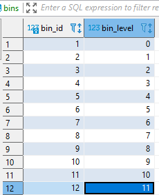

# flashcards in Vue

## DB Schema
User table
| column      | type              | description                                                                        |
|-------------|-------------------|------------------------------------------------------------------------------------|
| user_id     | serial/primaryKey |                                                                                    |
| username    | text              | The unique id name for each user. It is randomly generated on new account creation |
| provider    | text              | Name of the third party login system used by a user                                |
| provider_id | text              | Identifier of the user logging in with 3rd party sign in                           |

Card table

| column              | type               | description                                                                                                                    |
|---------------------|--------------------|--------------------------------------------------------------------------------------------------------------------------------|
| card_id             | serial/primaryKey  |                                                                                                                                |
| user_id             | integer/foreignKey | User who the flash card belongs to.                                                                                            |
| word                | text/uniqueKey     | Flash card word. A user cannot create duplicate words. Has a unique key constraint shared with the user_id.                    |
| definition          | text/uniqueKey     | Definition of the word.                                                                                                        |
| bin_id      | smallInt/foreignKey           | The bin number the word is currently in. Default 1.                                                          |
| bin_word_date_added | timestamp          | Time the word was placed in the bin. Will be used against current timestamp to measure the next time  the card should appear.  |
| word_wrong_count    | smallInt           | Tracks the number of times the user got the answer wrong.                                                                      |

Bins table ( a simple table to help manage and query cards in bins)
| column              | type              | description                                                                                                                    |
|---------------------|-------------------|--------------------------------------------------------------------------------------------------------------------------------|
| bin_id              | serial/primaryKey |                                                                                                                                |
| bin_level           | integer           | The bin number that cards move into. Range 0-11   

Example table data

SQL Scripts

**bins_gets_cards_in_bins.sql**
- Returns a list of cards that are currently in Bin ##.
- Used in the Admin main section of the admin page

**bins_get_total_cards_in_bins.sql**
- Returns a list of bins with counts of cards in a bin.
- Used in the Admin section sidebar to preview and navigate to cards in a bin

**cards active_cards.sql** 
- Gets all the card_ids by a user_id that could be shown in the future.  
- Used as helper script to help pick which alert message to display in CardController.

**cards_draw_cards.sql**
- A list of a potiential cards that maybe drawn on the homepage.

**cards_update_bin_card.sql**
- This stored procedure function is run when the user answers 'i got it' and 'i did not get it'.

Actions:
* Sets the delay time when card should next appear
* Moves the card to next bin or down to the start bin
* Increments the answered wrong totals
* Assigns the card to be hidden forever if it is too hard to remember
